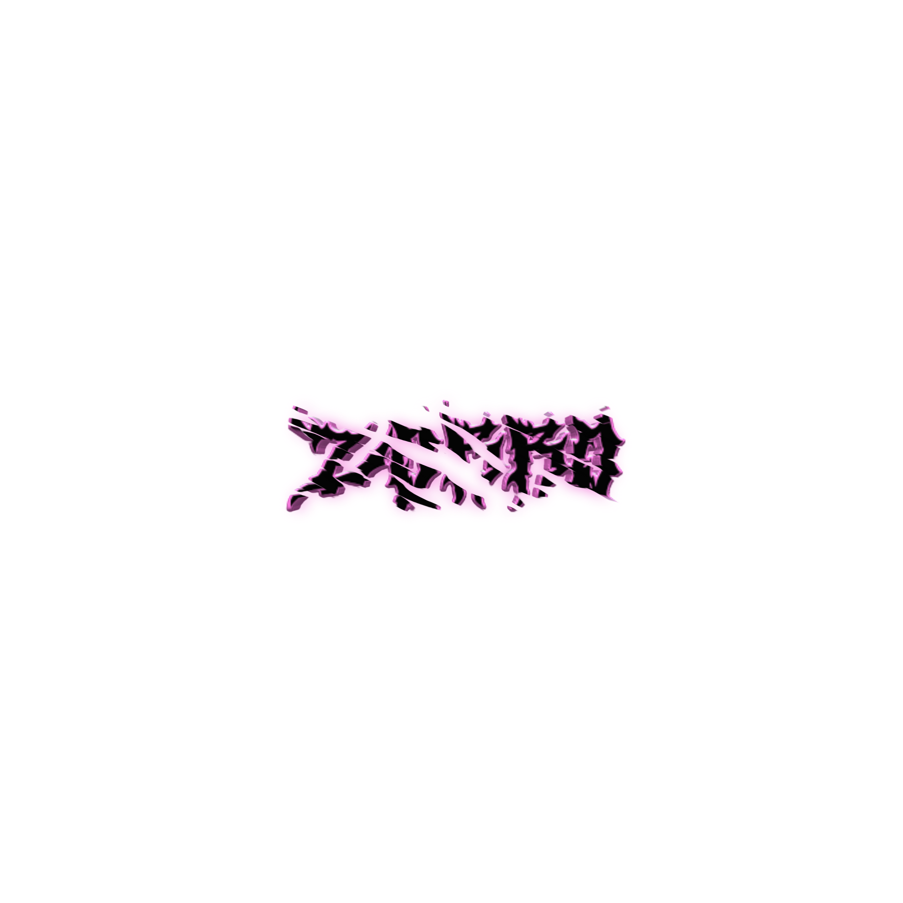

  

<h1>[🍀]Olá</h1>

- [🎶] Musica Favorita: El Problema

<h3><em>[🌐]Languages:</em></h3>
<blockquote>
  <ul>
    <li><em>Python 100%</em></li>
    <li><em>Java 10%</em></li>
    <li><em>JavaScript 95%</em></li>
    <li><em>C 100%</em></li>
    <li><em>C# 40%</em></li>
    <li><em>C++ 50%</em></li>
    <li><em>HTML 100%</em></li>
    <li><em>CSS 100%</em></li>
  </ul>
</blockquote>

  Programo a 2 anos tenho 11 anos tenho um canal no Yotube chamado Zorro.
  <a style="font-family: sans-serif" href="https://youtube.com/channel/UCTRSuQ_j0qwRKxI9mMioeyg">Meu Canal Aqui.</a>

  

  
 <b>Clique</b> <i>(Aqui)</i> 

   
  

